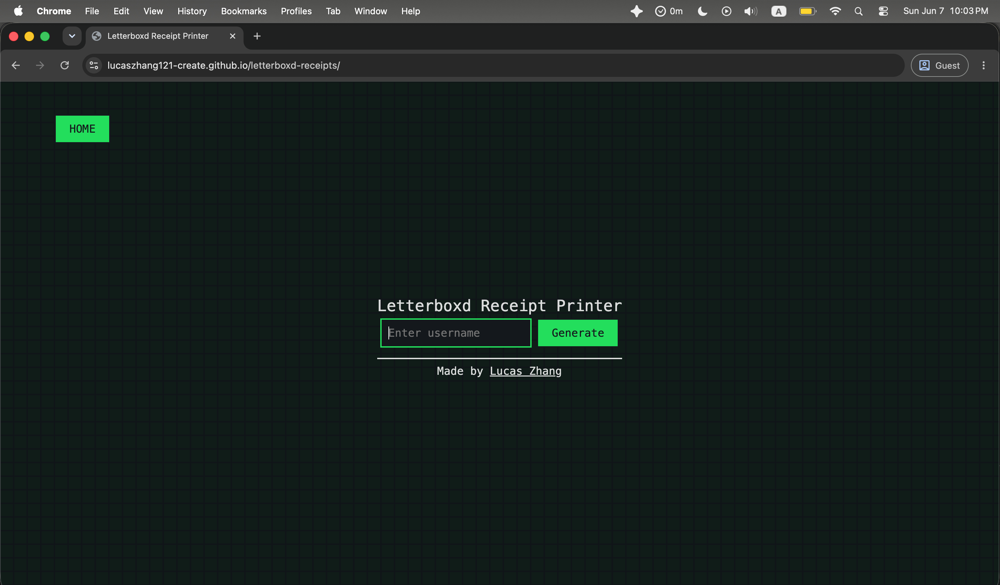
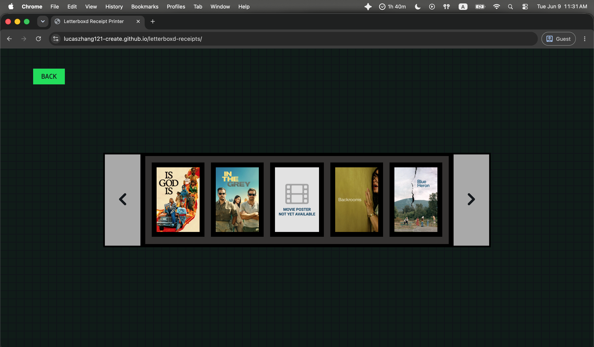
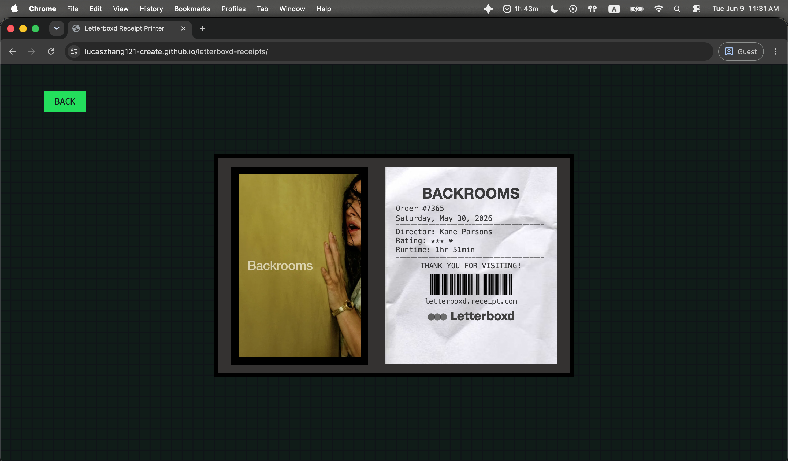

Description:
Letterboxd Receipts is a web app inspired by the viral Receiptify app made by Michelle Liu.  Receiptify generates a receipt detailing a Spotify user's most played songs within a certain time period. However, instead of outputting a periodic summary, like many would assume this app does, Letterboxd Receipts creates an individual receipt for one of the last ten movies a user has watched. It also has an option to show similar films.

Images:

  
  
  

Motivation:
A core inspiration for creating Letterboxd Receipts came from Instagram story posts by people who visited the theater recently. Many of them were composed of a picture of the screen taken in the theater during the movie. Personally, not wanting to have to worry about taking my phone out at the perfect time, I have always opted to take a picture of the posters outside the theater instead. Still, the results were not always satisfactory.

How to use:
Using Letterboxd Receipts is simple. 
1. Enter your Letterboxd username and click generate.
2. Pick a movie by its respective poster from one of the five options on the screen.
3. If more than five movies are logged, clicking the navigation buttons on both sides can show up to five more options.
4. Watch a receipt of your most recent watch fill the screen.
Want to make a receipt for another recent watch too? Click the back button to return to the selection window. If without a Letterboxd account, use username "JosephMoes" for the demo. Popular Letterboxd account usernames also include "jonathanfujii" and "annehathaway". To find these Letterboxd account usernames, open up the letterboxd account and check the url. It should be in the format letterboxd.com/[username].
5. Click on "Show similar films" to get recommendations from the TMDB API and "Hide similar films" to hide the panel.

How it works:
In order to achieve the purpose of the app, the Letterboxd API was needed. Letterboxd is a movie-logging app where over 28 million cinephiles in over 190 countries log, rate, and review films. The issue is, the Letterboxd API is not open to the public. However, according to Letterboxd, "every member profile has an RSS feed of new diary entries, reviews and lists." The RSS feeds can be found at https://letterboxd.com/[username]/rss.

The Letterboxd RSS feeds are extremely helpful, pulling the last fifty films logged, watched, or reviewed by a user. The also provide valuable information such as the rating the user gave the movie, the release year of the film, whether the user liked it (gave it a heart), and most importantly, the TMDB ID.

The Movie Database (TMDB) is a web resource with details on movies ranging from the cast and crew to promotional posters and media. Its API is extremely well documented, and fetching the posters, getting the director name for the receipt, and getting recommendations is not too much of a hassle.

Tech Stack:
Frontend: HTML, CSS, and JavaScript
APIs: Letterboxd RSS Feed and The Movie Database (TMDB) API
Hosting: Github Pages

Tutorial use:
A tutorial was used for the Matrix Digital Rain effect function that was ultimately not implemented because it was too distracting for the project.

#horizons
